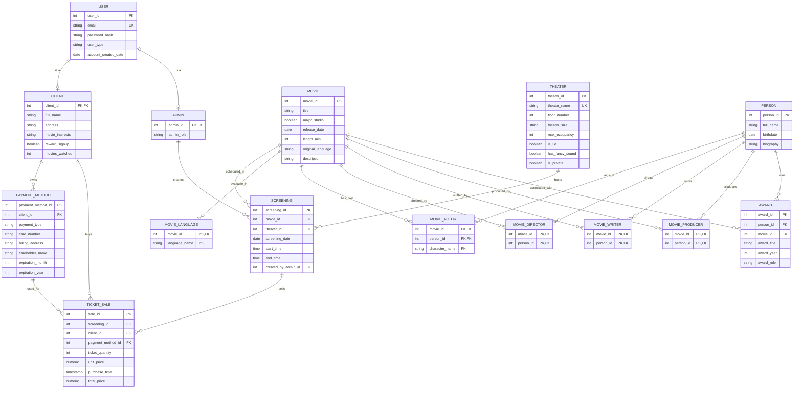

# ER Model (Mermaid)

Paste this into any Mermaid renderer or Markdown preview that supports Mermaid.

```mermaid
erDiagram
    USER ||--o| CLIENT : "is a"
    USER ||--o| ADMIN : "is a"
    CLIENT ||--o{ PAYMENT_METHOD : owns
    ADMIN ||--o{ SCREENING : creates

    MOVIE ||--o{ SCREENING : scheduled_in
    THEATER ||--o{ SCREENING : hosts
    SCREENING ||--o{ TICKET_SALE : sells

    MOVIE ||--o{ MOVIE_LANGUAGE : available_in
    MOVIE ||--o{ MOVIE_ACTOR : has_cast
    MOVIE ||--o{ MOVIE_DIRECTOR : directed_by
    MOVIE ||--o{ MOVIE_WRITER : written_by
    MOVIE ||--o{ MOVIE_PRODUCER : produced_by

    PERSON ||--o{ MOVIE_ACTOR : acts_in
    PERSON ||--o{ MOVIE_DIRECTOR : directs
    PERSON ||--o{ MOVIE_WRITER : writes
    PERSON ||--o{ MOVIE_PRODUCER : produces
    PERSON ||--o{ AWARD : wins
    MOVIE ||--o{ AWARD : associated_with

    CLIENT ||--o{ TICKET_SALE : buys
    PAYMENT_METHOD ||--o{ TICKET_SALE : used_for

    USER {
        int user_id PK
        string email UK
        string password_hash
        string user_type
        date account_created_date
    }

    CLIENT {
        int client_id PK, FK
        string full_name
        string address
        string movie_interests
        boolean reward_signup
        int movies_watched
    }

    ADMIN {
        int admin_id PK, FK
        string admin_role
    }

    PAYMENT_METHOD {
        int payment_method_id PK
        int client_id FK
        string payment_type
        string card_number
        string billing_address
        string cardholder_name
        int expiration_month
        int expiration_year
    }

    MOVIE {
        int movie_id PK
        string title
        boolean major_studio
        date release_date
        int length_min
        string original_language
        string description
    }

    THEATER {
        int theater_id PK
        string theater_name UK
        int floor_number
        string theater_size
        int max_occupancy
        boolean is_3d
        boolean has_fancy_sound
        boolean is_private
    }

    SCREENING {
        int screening_id PK
        int movie_id FK
        int theater_id FK
        date screening_date
        time start_time
        time end_time
        int created_by_admin_id FK
    }

    TICKET_SALE {
        int sale_id PK
        int screening_id FK
        int client_id FK
        int payment_method_id FK
        int ticket_quantity
        numeric unit_price
        timestamp purchase_time
        numeric total_price
    }

    PERSON {
        int person_id PK
        string full_name
        date birthdate
        string biography
    }

    MOVIE_LANGUAGE {
        int movie_id PK, FK
        string language_name PK
    }

    MOVIE_ACTOR {
        int movie_id PK, FK
        int person_id PK, FK
        string character_name PK
    }

    MOVIE_DIRECTOR {
        int movie_id PK, FK
        int person_id PK, FK
    }

    MOVIE_WRITER {
        int movie_id PK, FK
        int person_id PK, FK
    }

    MOVIE_PRODUCER {
        int movie_id PK, FK
        int person_id PK, FK
    }

    AWARD {
        int award_id PK
        int person_id FK
        int movie_id FK
        string award_title
        int award_year
        string award_role
    }
```
